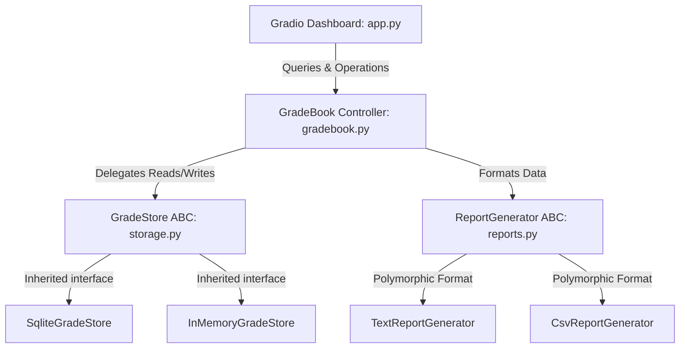

# 🎓 Student Grade Tracker (Notenverwaltung)

An interactive, premium web dashboard and registry system built in Python to manage student registries, course catalogs, grading schemas, and data persistence.

---

## 🌟 Key Features

* **Gradio Web Dashboard**: Modern interface featuring interactive tables, live statistics, dynamic student/course dropdown selectors, and an SVG chart showing course pass rates.
* **SQLite Database Engine**: Data is persisted permanently on disk with relational constraints (foreign key enforcement).
* **Bulk CSV Import & Export**: Import and export registry data for Students, Courses, and Grades in a single click (test templates included).
* **Automated Format Reports**: Generate plain-text summary reports and CSV course metrics spreadsheets.
* **Robust Test Coverage**: 36 automated unit and integration tests covering data validation, database persistence, and report generation.

---

## 🚀 Quick Start Guide

### 1. Prerequisite
Ensure you have the ultra-fast Python package manager **`uv`** installed. If not, install it using the command matching your OS (or use `pip install uv`).

### 2. Launch the Web App
Run the following command in your terminal from the project root:

```powershell
uv run python -m notenverwaltung.app
```

Then, open your web browser and go to:
👉 **`http://127.0.0.1:7860`**

### 3. Run Automated Tests
Verify that all unit and integration tests pass successfully by running:

```powershell
uv run pytest
```

---

## 📊 Using the Test CSV Data

To make testing easy, we have included three pre-configured test files in the project root:
* **Students Registry**: Import [test_students.csv](file:///c:/Users/gh-w/Coding%20acadime/Software%20Engineering%20(AZAV)/projects/grade_tracker/test_students.csv) on the **Manage Students** tab.
* **Course Catalog**: Import [test_courses.csv](file:///c:/Users/gh-w/Coding%20acadime/Software%20Engineering%20(AZAV)/projects/grade_tracker/test_courses.csv) on the **Manage Courses** tab.
* **Grade Registry**: Import [test_grades.csv](file:///c:/Users/gh-w/Coding%20acadime/Software%20Engineering%20(AZAV)/projects/grade_tracker/test_grades.csv) on the **Record Grades** tab.

*Note: Import the students and courses first so that the grade records match existing relational IDs.*

---

## 📂 Codebase Layout

```text
grade_tracker/
├── pyproject.toml              # UV configuration & project dependencies
├── README.md                   # This file (project overview and startup)
├── STUDY_GUIDE.md              # Homework guide & core concepts documentation
├── src/                        # Isolated source folder for clean builds
│   └── notenverwaltung/        # The root package of our code
│       ├── __init__.py         # Makes 'notenverwaltung' a package
│       ├── exceptions.py       # Custom exceptions (e.g. StudentNotFoundError)
│       ├── gradebook.py        # Business logic, math stats, and CSV parsers
│       ├── models/             # Student, Course, and Grade dataclass models
│       ├── storage.py          # Data persistence layer (InMemory & SQLite)
│       ├── reports.py          # Report generators (Text & CSV formats)
│       └── app.py              # Gradio web application interface
└── tests/                      # Automated test suite (test_*.py files)
```

---

## 📋 Requirements Mapping

Here is how the project satisfies the specific core homework rubric requirements:

| Topic Area | Where in Project | Implementation Details |
| :--- | :--- | :--- |
| **Object-Oriented Design** | `models/student.py`<br>`models/course.py`<br>`models/grade.py` | Uses `@dataclass` for structural domain mapping. Uses `__post_init__` for range and format validations. Uses properties (`@property`) like `full_name`, `is_passing`, and `letter_grade` for calculations. |
| **Data Aggregation & Stats**| `gradebook.py` | Calculates student averages, course averages, and course pass rates using list comprehensions and dictionaries. |
| **Fuzzy Registry Search** | `gradebook.py` | Implements `search_students` and `search_courses` utilizing Python's `re` module with case-insensitive regular expression matching. |
| **Serialization & File I/O**| `gradebook.py` | Implements `to_dict` and `from_dict` JSON roundtrip routines, and custom `import_csv` / `export_csv` parsers that handle errors gracefully and compile validation reports. |
| **Database Persistence** | `storage.py` | Relational table schema design using `sqlite3`. Enforces standard foreign key constraints, index lookups, and transactional data integrity. |
| **Polymorphism & Reports** | `reports.py` | Implements abstract base class (`ReportGenerator`) with three abstract generator methods (`generate_student_report`, `generate_course_report`, and `generate_summary_report`) overridden by `TextReportGenerator` and `CsvReportGenerator`. |
| **Robust Error Handling** | `exceptions.py` | Defines custom exceptions like `StudentNotFoundError`, `CourseNotFoundError`, and `DuplicateEntryError` to prevent generic value errors and display targeted user feedback in the UI. |

---

## ⚙️ Technical Architecture Details

The system is designed following professional software engineering principles:



### 1. Abstract Storage Layer (Repository Pattern)
We decouple the controller logic (`GradeBook`) from the database layer by declaring an Abstract Base Class (`GradeStore`) in `storage.py`.
* The `GradeBook` doesn't know whether it is communicating with an in-memory dictionary or a SQLite database file. We inject the storage engine during initialization: `gb = GradeBook(store=SqliteGradeStore("grades.db"))`.
* This allows testing the controller business logic in isolation using memory mocks without touching disk databases.

### 2. SQLite Foreign Key Configuration
SQLite disables foreign keys by default for backward compatibility. 
* To ensure database-level relational integrity (preventing invalid grades for non-existent students or courses), we execute `PRAGMA foreign_keys = ON;` inside our connection handler. Since this setting is connection-level, our connection hook executes it every single time a transaction opens.

### 3. Polymorphic Reports
`ReportGenerator` acts as the interface contract. `TextReportGenerator` formats the records into visual ASCII-aligned tables using string padding formatters (`:<20`). `CsvReportGenerator` formats the exact same metrics into raw CSV buffers using Python's standard `csv` module, returning them as strings or writing them directly to files.

### 4. Reactive Single-State UI Updates
Gradio UI components are updated in a single execution flow. Every click handler in `app.py` triggers database operations and then calls `update_all_ui(message)`. This function queries the database once and returns a multi-value tuple containing up-to-date dataframes, dropdown choices, plots, and logs, updating all tabs instantly.
